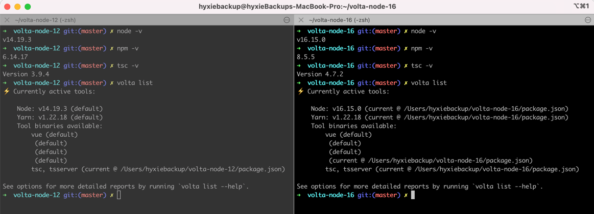
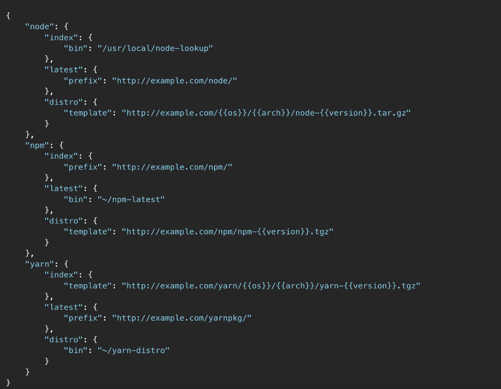

# 第26期技术雷达web blips介绍


## Volta

Volta是javascript工具管理器。在工作在多个javascript代码库的时候，我们常常需要使用不同版本的Node和其他javascript工具，避免不了在多个版本之间进行切换。
已知的nvm可以帮助我们管理不同的node版本。而volta是另外一个替换方案，与nvm相比，volta具有如下优点。


- 它可以管理其他 JavaScript 工具；
  - 设置、切换node引擎
  - 管理package manager，例如yarn、npm

- 基于项目绑定工具链版本, volta会记录如下工具的版本在工具链中
  - Node runtime 
  - Package Manager - npm，yarn 
  - Executables && Package binaries

### 常用的volta command:

```shell
➜  ~ curl https://get.volta.sh | bash

➜  ~ volta install node@16
success: installed and set node@16.15.0 (with npm@8.5.5) as default

➜  ~ volta install yarn
success: installed and set yarn@1.22.18 as default

➜  volta-node-16 git:(master) ✗ volta pin node@16
success: pinned node@16.15.0 (with npm@8.5.5) in package.json

➜  volta-node-16 git:(master) ✗ volta pin yarn@1.22.18
success: pinned yarn@1.22.18 in package.json

```

### Volta管理的项目版本对比
以下是用volta管理的，使用不同版本javascript工具创建的项目`volta-node-12`, `volta-node-16`. 
使用volta管理项目，进入项目目录时，volta会根据所在的项目检测所用的工具版本并进行路由，开发者不需要关心工具的版本，担心因为版本问题导致项目运行出错等



### volta hook:

可以通过配置hooks（～/.volta/hooks.json）指定node、yarn、node安装来源。




## SPA


## 