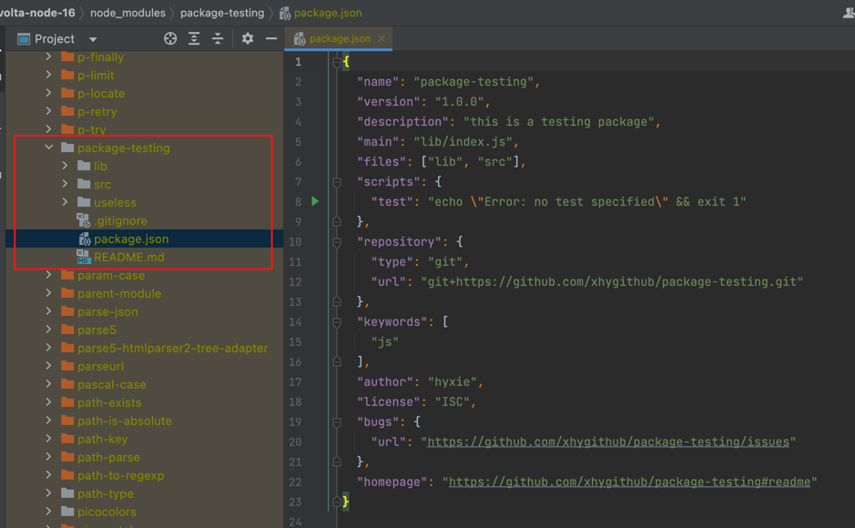
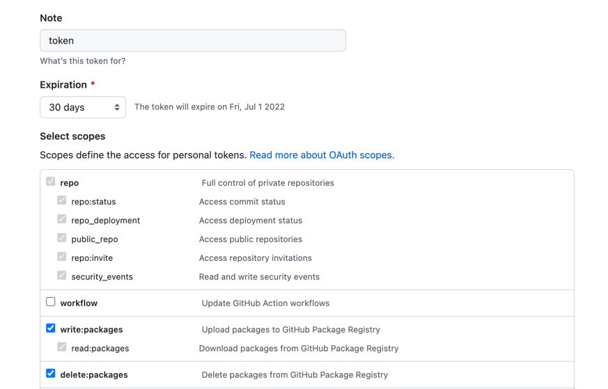
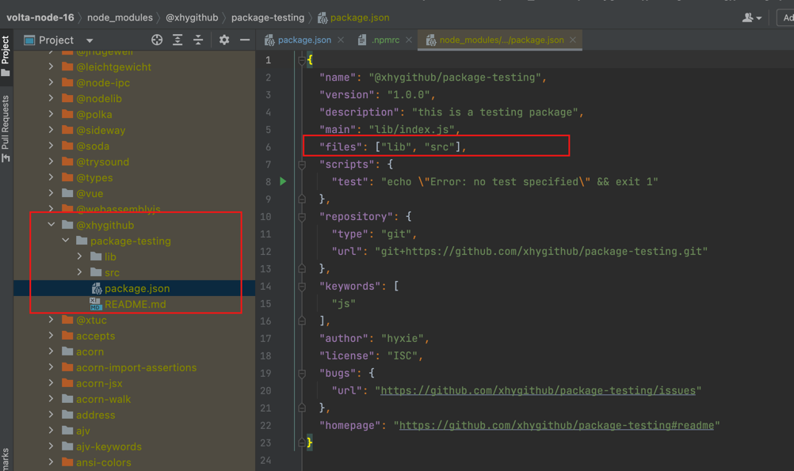
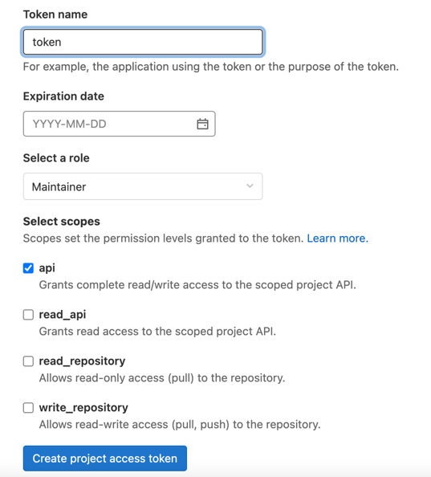
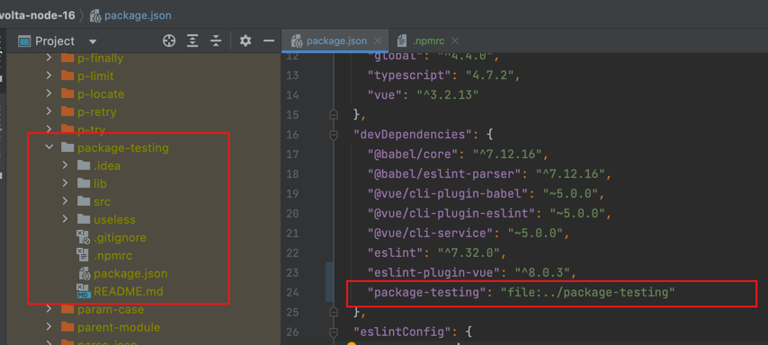
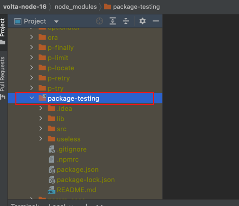

# How to share and install external packages as dependency?

Under many scenarios, in order to reduce the duplication and complexity, we create separate repositories which include frequently used functions or 
foundational features. And these repositories or packages can be installed by other projects as dependencies. The problem is how we make it work.

As we all know, npm is a world's largest software registry. Developers can use npm to share and borrow packages.
Today I will introduce several ways to share packages and collaborate with others using npm.

###  Git URLs and Other Packages Registry

Before we start, we will create two repositories as example, one is `package-testing`, another is `volta-node-16` which uses package-testing as a dependency.

#### 1. Git URLs as Dependency directly, no need to use npm to publish package

The following is `package.json` of `package-testing` the dependency project

```Json
{
  "name": "package-testing",
  "version": "1.0.0",
  "description": "this is a testing package",
  "main": "index.js",
  "scripts": {
    "test": "echo \"Error: no test specified\" && exit 1"
  },
  "repository": {
    "type": "git",
    "url": "git+https://github.com/xhygithub/package-testing.git"
  },
  "keywords": [
    "js"
  ],
  "author": "hyxie",
  "license": "ISC",
  "bugs": {
    "url": "https://github.com/xhygithub/package-testing/issues"
  },
  "homepage": "https://github.com/xhygithub/package-testing#readme"
}


```

After commit and push, you can view the project in GitHub. If you want to install package-testing as dependency, you can add package-testing in devDependencies field:

```json
{
  "name": "volta-node-16",
  "version": "0.1.0",
  "private": true,
  "scripts": {},
  "dependencies": {},
  "devDependencies": {
    "package-testing": "git+https://github.com/xhygithub/package-testing.git"
  }
}

```

This tarball will be downloaded and installed locally in node_modules.



This way is straightforward. Git helps to track the change of package-testing. 
If you want to install the dependency with specific version, you can tag commit and then specify dependency version as following:

```json
{
  "package-testing": "git+https://github.com/xhygithub/package-testing.git#v1.0.27"
}
```
The disadvantage of using GitURL is that the whole package-testing repo will be exposed in `volta-node-16` project. What you can see is not only compressed and compiled files, but also source code of entire repo.


#### 2. Working with GitHub Packages registry

You can configure npm to publish packages to GitHub Packages and to use packages stored on GitHub Packages as dependencies in an npm project.

1. Authenticate to GitHub Packages.

Follow "[Authenticating to GitHub Packages](https://docs.github.com/en/packages/learn-github-packages/about-permissions-for-github-packages#about-scopes-and-permissions-for-package-registries)", entering `Settings > Developer Settings > Personal access tokens` to apply the Personal Access Token



2. `[Option 1]` Authenticate and Specify GitHub Packages URL(.npmrc config)
```
@xhygithub:registry=https://npm.pkg.github.com
//npm.pkg.github.com/:_authToken=${TOKEN}
```

2. `[Option 2]` Authenticate and Specify GitHub Packages URL(.npmrc and package.json config)
```
//npm.pkg.github.com/:_authToken=${TOKEN}
```

```json
{
  "publishConfig": {
    "name": "@xhygithub/package-testing",
    "registry": "https://npm.pkg.github.com/xhygithub"
  }
}
```

3. Change Package name and version
Before running *npm publish*, you need to change the package name to *@xhygithub/package-testing* (The name field must contain the scope and the name of the package) and
update the version field in package.json

5. Publish package
```shell
TOKEN=xxxx npm publish 
```

5. View Packages under Packages tab in Github

6. Install Package as dependencies
Do the same thing as above "2. [Option 1]" to authenticate and specify GitHub Packages URL

```json
{
  "@xhygithub/package-testing": "latest"
}
```
7. Check the node_modules
After running `TOKEN=xxxx yarn`, `@xhygithub/package-testing` will appear in node_modules



Compared with the picture "dependency-install-using-github-url", you will find out only the src and lib folder appears in package-testing.
#### 3. Working with Gitlab Packages registry

Same as working with GitHub packages registry

1. Apply access token to authenticate to the Package Registry



2. Authenticate and Specify Gitlab Packages URL(instance-level or project-level) to publish package

local .npmrc file:
```
# package with name `@my-scope/xxxx` will use this URL for download
@my-scope:registry=https://gitlab.example.com/api/v4/projects/${project_id}/packages/npm/

# Add the token for the scoped packages UR
//gitlab.example.com/api/v4/projects/${project_id}/packages/npm/:_authToken=${TOKEN}
//gitlab.example.com/api/v4/packages/npm/:_authToken=${TOKEN}
//gitlab.example.com/api/v4/projects/:_authToken=${TOKEN}
```

3. publish package
```
TOKEN=xxxx npm publish
```
4. Install Package as dependencies

#### 4. Working with npm Packages registry

Almost same as GitHub and Gitlab packages registry, following official doc [publish scoped packages](https://docs.npmjs.com/creating-and-publishing-scoped-public-packages) will teach u how to work with npm Packages registry.

### How to develop and debug dependency packages locally?

Although the above tells us how to upload dependency package and download package as dependency. Another thing we can not ignore is how to test and debug
the dependency packages locally before it is uploaded.


#### 1. set local paths 

```json
{
  "name": "volta-node-16",
  "dependencies": {
    "package-testing": "file:${PATH_TO_PACKAGE_TESTING_DIRECTORY}" 
  }
}
```
This feature is helpful for local offline development. After execute `yarn` or `npm install`, the local `package-testing` project will be added to node_modules



#### 2. npm link

1. Execute `npm link` (in package dir) will create a symlink in the global folder
```shell
➜  package-testing git:(master) ✗ npm link   
   
${globalFolderPrefix}/lib/node_modules/package-testing -> ${currentProjectPrefix}/package-testing
```


2. `npm link package-name` will create a symbolic link from globally-installed package-name to node_modules/ of the current folder

```shell
➜  volta-node-16 git:(master) ✗ npm link package-testing   

symbolic link -> ${globalFolderPrefix}/lib/node_modules/package-testing
```




Now as long as you follow the above process, you can create your own packages which can be shared by other projects. And you don't have to worry about how to test and debug in local env  


